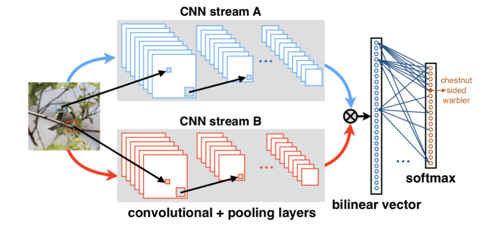
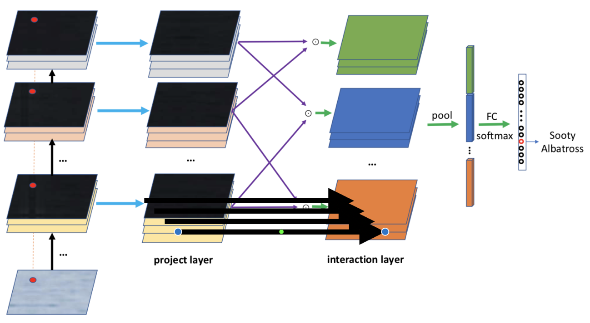

# HBP

## 细粒度图像分类

细粒度图像分类旨在同一大类图像的确切子类。由于不同子类之间的视觉差异很小，而且容易受姿势、视角、图像中目标位置等影响，这是一个很有挑战性的任务。因此，类间差异通常比类内差异更小。双线性汇合（bilinear pooling）计算不同空间位置的外积，并对不同空间位置计算平均汇合以得到双线性特征。外积捕获了特征通道之间成对的相关关系，并且这是平移不变的。双线性汇合提供了比线性模型更强的特征表示，并可以端到端地进行优化，取得了和使用部位（parts）信息相当或甚至更高的性能。

在这次报告中，我们将对使用双线性汇合进行细粒度分类的方法发展历程予以回顾。研究方向大致分为两类：设计更好的双线性汇合过程，以及精简双线性汇合。其中，对双线性汇合过程的设计主要包括对汇合结果规范化过程的选择及其高效实现，以及融合一阶和二阶信息。精简双线性汇合设计大致有三种思路：利用PCA降维、近似核计算、以及低秩双线性分类器。此外，双线性汇合的思想也被用于其他计算机视觉领域，例如风格迁移、视觉问答、动作识别等。我们也将介绍双线性汇合在这些领域的应用。

## 双线性模型

对函数 $f(x,y)$，双线性（bilinear）是指当固定其中一个参数（例如$x$ ）时， 对另一个$f(x,y)$参数（例如$y$）是线性的。在这里，研究的双线性函数是形 如$f(x,y)=x^\top y$ 这样的形式。双线性汇合的时候其计算过程都是可以通过梯度下降的算法将误差进行反向传播从而优化参数的。本文关注的双线性汇合叫双线性这个名字是受历史的影响，在早期两个分支是不同的，现在主流做法是两个分支使用相同的输入，整个操作将变为非线性而不是双线性，但这个名称沿用至今。

目前主流的双线性模型都是以VGG-16作为主干网络，使用其中的底层的卷积特征作为特征描述子，也就是作为双线性的参数进行双线性池化过程。在以前的文章中探究了不同超参数的效果，比如使用不同的网络产生的特征描述子的效果要显著好于使用相同网络产生的特征描述子，使用在部分共享参数的模型要比全部共享或者全部不共享参数的模型效果也好很多。

双线性汇合在深度学习复兴前就已经被提出，随后，在细粒度图像分类领域得到了广泛使用。本节将介绍双线性变体 Hierarchical Bilinear Pooling。

## HBP

在细粒度图像分类中，双线性池化(bilinear pooling)的模型已经被证明是有效的，然而，先前的大多方法忽略了这样一个事实：层间部分特征交互和细粒度特征学习是相互关联的并且可以相互加强。根据这一问题，作者提出一种新的模型结构。(1)提出了一种可跨层的双线性池化方法，用来捕获层间部分特征的关系。(2)提出一种集成多个跨层双线性特征的分层双线性池化框架，增强模型的表示能力。

HBP模型通过提取层次上的特征描述子来提高信息的泛化能力，如从VGG-16的relu_1,relu_2,relu3产生的从上到下的特征描述子进行双线性汇合，并使用级联的方式将池化结果作为分类特征。最后在三个细粒度公开数据集数据集上都得到了很好的结果。

## 代码及实验结果

请查看[此处](./2018104081/src/scripts/)

## 参考

1. Fu, J., Zheng, H., Mei, T.: Look closer to see better: Recurrent attention convo- lutional neural network for fine-grained image recognition. In: Conf. on Computer Vision and Pattern Recognition (2017) 
    
2. Gao, Y., Beijbom, O., Zhang, N., Darrell, T.: Compact bilinear pooling. In: Pro- ceedings of the IEEE Conference on Computer Vision and Pattern Recognition. pp. 317–326 (2016) 
    
3. Jaderberg, M., Simonyan, K., Zisserman, A., et al.: Spatial transformer networks. In: Advances in neural information processing systems. pp. 2017–2025 (2015) 
    
4. Krause, J., Jin, H., Yang, J., Fei-Fei, L.: Fine-grained recognition without part annotations. In: Computer Vision and Pattern Recognition (CVPR), 2015 IEEE Conference on. pp. 5546–5555. IEEE (2015) 
    
5. Lin, T.Y., RoyChowdhury, A., Maji, S.: Bilinear cnn models for fine-grained visual recognition. In: Proceedings of the IEEE International Conference on Computer Vision. pp. 1449–1457 (2015) 
    
6. Zhang, X., Xiong, H., Zhou, W., Lin, W., Tian, Q.: Picking deep filter responses for fine-grained image recognition. In: Proceedings of the IEEE Conference on 
    Computer Vision and Pattern Recognition. pp. 1134–1142 (2016) 

7. Zheng, H., Fu, J., Mei, T., Luo, J.: Learning multi-attention convolutional neural network for fine-grained image recognition. In: Int. Conf. on Computer Vision (2017) 
8. [双线性汇合（bilinear pooling）在细粒度图像分析及其他领域的进展综述](https://zhuanlan.zhihu.com/p/47415565)
9. [细粒度识别之Hierarchical Bilinear Pooling](https://zhuanlan.zhihu.com/p/47608165) 

## 

